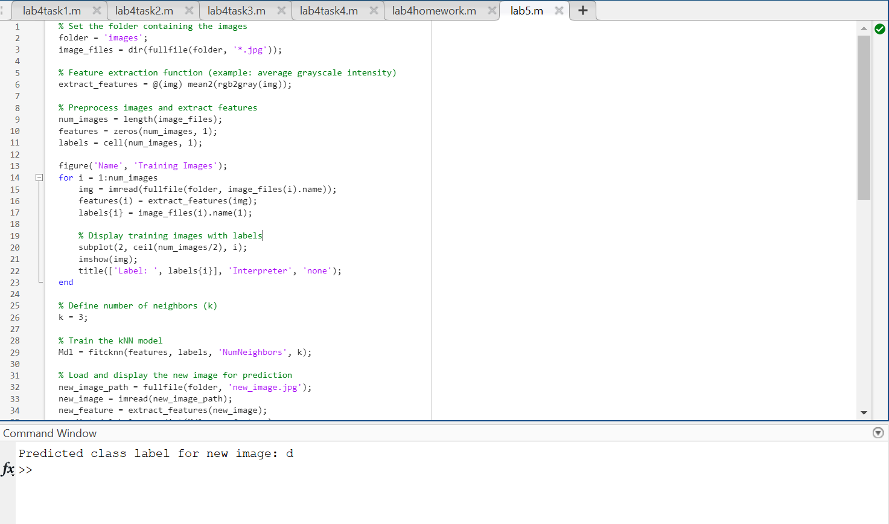
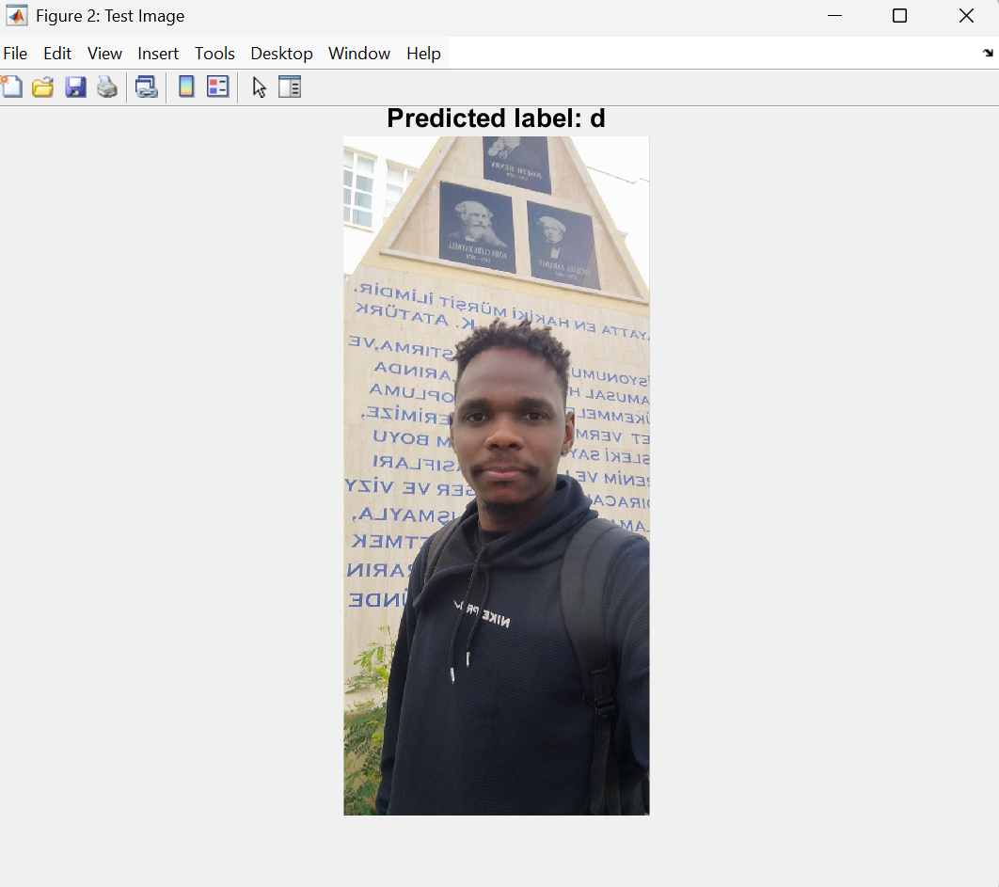

#  Biomedical Image Classification with k-Nearest Neighbors (k-NN)

This project performs simple image classification using the **k-Nearest Neighbors (k-NN)** algorithm in MATLAB. It demonstrates basic machine learning for biomedical image processing.

---

##  Project Structure

```
lab5/
├── lab5.m                  # Main MATLAB script for training and testing
├── images.zip              # Compressed folder containing labeled image dataset
├── TrainingImages.png      # Screenshot of training images with labels
├── TestImage.png           # Screenshot of test image and predicted label
└── README.md               # This file
```

---

##  Getting Started

### 1. Unzip the Dataset

Before running the code, **unzip the `images.zip` folder** so the script can access the training and test images.

```bash
# Unzip the images folder
unzip images.zip
```

This will create an `images/` folder containing the images.

---
## MATLAB Script Preview

Here's a snapshot of the MATLAB script used to train and test the classifier:  


### 2. Run the Code

Launch MATLAB, navigate to the project directory, and run:

```matlab
lab5
```

The script will:

- Load images from the `images/` folder  
- Extract average grayscale intensity as features  
- Train a k-NN classifier (k=3)  
- Predict the class of a new test image (`new_image.jpg`)  
- Display results using figures

---

##  Output Example

### Training Images  
Displays all images in the dataset with their associated labels:  


### Test Image and Prediction  
Displays the test image and its predicted class:  


---

##  How It Works

- **Feature Extraction**: Each image is converted to grayscale, and the average intensity is used as the feature.  
- **kNN Classification**: The algorithm compares the test image to training images and assigns the most common label among the k closest neighbors.  
- **Visualization**: MATLAB plots the training dataset and test result.

---

##  Requirements

- MATLAB (tested with R2022a+)
- Image Processing Toolbox

---

##  Author

- Awab Abdelhadi Yagoub Abdallah
- BMED469 Biomedical Image Processing Lab

---

##  Future Improvements

- Replace average intensity with more advanced features (HOG, entropy, CNN).
- Add confusion matrix and accuracy reporting.
